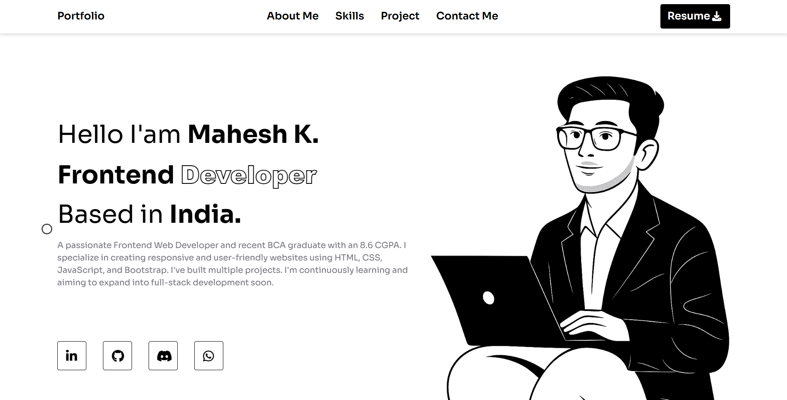

Perfect Mahesh 👍 Since your portfolio is live at **[maheshkudleppanavar.netlify.app](https://maheshkudleppanavar.netlify.app/)** and we already polished your LinkedIn write-up, I’ll now prepare a **GitHub README.md documentation** that explains your project clearly.

Here’s a professional version tailored for GitHub:

---

# 🎨 Illustration-Based Portfolio Website

This is my **first portfolio project**, built from scratch to showcase my skills in **frontend web development**.
The website is designed with illustrations and focuses on responsiveness, clean layout, and modern design principles.

🌐 **Live Demo**: [maheshkudleppanavar.netlify.app](https://maheshkudleppanavar.netlify.app/)

---

## 🚀 Features

* 📌 **Illustration-based design** for a creative portfolio
* 🌍 **Responsive across all devices** using media queries, flexbox, and grid
* ⚡ Built entirely with **HTML, CSS, and JavaScript**
* 🎯 Smooth navigation and clean layout
* 💡 Hands-on application of theoretical knowledge into a real project

---

## 🛠️ Tech Stack

* **HTML5** – structure of the website
* **CSS3** – styling, animations, and layout
* **JavaScript (Vanilla JS)** – interactivity and dynamic behavior

---

## 📖 Learning Outcomes

While building this project, I:

* Practiced **design-to-website conversion**
* Understood limitations of the **box model** and shifted to **flexbox & grid** for better responsiveness
* Learned how to structure a portfolio for **usability and aesthetics**
* Strengthened my understanding of **responsive design principles**

---

## 📂 Project Structure

```bash
├── index.html        # Main landing page  
├── style.css         # Styling with Flexbox, Grid, and Media Queries  
├── script.js         # JavaScript for interactivity  
├── assets/           # Images, illustrations, and icons  
└── README.md         # Project documentation  
```

---

## 📸 Preview  

  
*(Homepage preview of my portfolio — [Live Demo](https://maheshkudleppanavar.netlify.app/))*


## 🌟 Future Improvements

* Add **backend integration** (Node.js) for form handling
* Explore **React.js** for a dynamic portfolio
* Improve animations with **GSAP / AOS library**

---

## 👨‍💻 Author

**Mahesh Kudleppanavar**

* 📧 \maheshkudleppanavar@gmail.com
* 🌐 \https://www.linkedin.com/in/mahesh-kudleppanavar-b59132258?lipi=urn%3Ali%3Apage%3Ad_flagship3_messaging_conversation_detail%3BqEeZ83%2FPSku2lg11OQ1yWg%3D%3D
* 💻 Portfolio Website](https://maheshkudleppanavar.netlify.app/)

---

🔗 *If you like this project, consider giving it a ⭐ on GitHub!*

---
